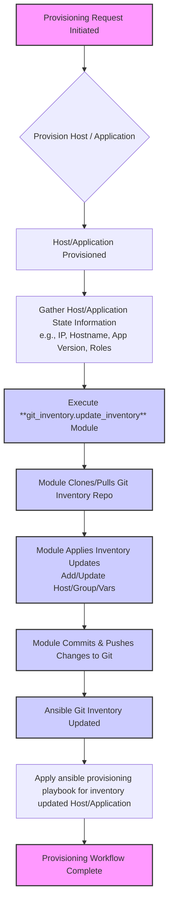
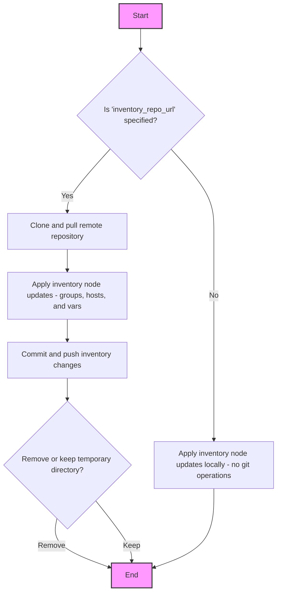

[](LICENSE.md)

# Dettonville Ansible Git Inventory Collection

## Table of Contents

* [Summary](#summary)
* [CI Status](#ci-status)
* [Requirements](#requirements)
* [Ansible Version Compatibility](#ansible-version-compatibility)
* [Included Content](#included-content)
* [Installing This Collection](#installing-this-collection)
* [Using This Collection](#using-this-collection)
* [Contributing to This Collection](#contributing-to-this-collection)
* [Testing](#testing)
* [Code of Conduct](#code-of-conduct)
* [🛡Identity & Maintainer](#identity-maintainer)
* [More Information](#more-information)

---

## Summary

The Ansible ``dettonville.git_inventory`` collection includes 3 modules (update_inventory, update_groups, and update_hosts) support adding, updating, and/or removing host and group nodes and respective variable values for a specified YAML-based inventory.

The modules can be integrated to establish Git for a "configuration-as-code" approach to Ansible inventory management.

## CI Status

[![🧪 GitHub Actions CI/CD workflow tests badge]][GHA workflow runs list]
[![pre-commit.ci status badge]][pre-commit.ci results page]

## Requirements

The host running the tasks must have the python requirements described in [requirements.txt](https://github.com/dettonville/ansible-git-inventory/blob/main/requirements.txt). Once the collection is installed, you can install them into a python environment using pip: `pip install -r requirements.txt`

<!--start requires_ansible-->

## Ansible Version Compatibility

This collection has been tested against the following Ansible versions: **>=2.16.0**.

Plugins and modules within a collection may be tested with only specific Ansible versions. A collection may contain metadata that identifies these versions. PEP440 is the schema used to describe the versions of Ansible.
<!--end requires_ansible-->

## Included Content

<!--start collection content-->

### Modules

| Documentation                                                                                               | Source code                                                                                                               | Description                                          |
|-------------------------------------------------------------------------------------------------------------|---------------------------------------------------------------------------------------------------------------------------|------------------------------------------------------|
| [update_inventory](https://github.com/dettonville/ansible-git-inventory/blob/main/docs/update_inventory.md) | [update_inventory.py](https://github.com/dettonville/ansible-git-inventory/blob/main/plugins/modules/update_inventory.py) | Add groups and/or hosts to git inventory repository. |
| [update_groups](https://github.com/dettonville/ansible-git-inventory/blob/main/docs/update_groups.md)       | [update_groups.py](https://github.com/dettonville/ansible-git-inventory/blob/main/plugins/modules/update_groups.py)       | Add groups to git inventory repository.              |
| [update_hosts](https://github.com/dettonville/ansible-git-inventory/blob/main/docs/update_hosts.md)         | [update_hosts.py](https://github.com/dettonville/ansible-git-inventory/blob/main/plugins/modules/update_hosts.py)         | Add hosts to git inventory repository.               |

<!--end collection content-->

## Installing This Collection

You can install the ``dettonville.git_inventory`` collection with the Ansible Galaxy CLI:

    ansible-galaxy collection install dettonville.git_inventory

You can also include it in a `requirements.yml` file and install it with `ansible-galaxy collection install -r requirements.yml`, using the format:

```yaml
---
collections:
  - name: dettonville.git_inventory
```

---

## Usage Overview

The features supported by the git_inventory modules are especially helpful when integrating an ansible YAML based inventory into a host and/or application provisioning workflow scheme as highlighted in the following graph.


```mermaid
graph TD
    A[Provisioning Request Initiated] --> B{Provision Host / Application};

    B --> C[Host/Application Provisioned];
    C --> D[Gather Host/Application State Information<br>e.g., IP, Hostname, App Version, Roles];
    D --> E[Execute **git_inventory.update_inventory** Module];
    E --> F[Module Clones/Pulls Git Inventory Repo];
    F --> G[Module Applies Inventory Updates<br>Add/Update Host/Group/Vars];
    G --> H[Module Commits & Pushes Changes to Git];
    H --> I[Ansible Git Inventory Updated];
    I --> J[Apply ansible provisioning playbook for inventory updated Host/Application];
    J --> K[Provisioning Workflow Complete];

    style A fill:#f9f,stroke:#333,stroke-width:2px;
    style E fill:#ccf,stroke:#333,stroke-width:2px;
    style F fill:#ccf,stroke:#333,stroke-width:2px;
    style G fill:#ccf,stroke:#333,stroke-width:2px;
    style H fill:#ccf,stroke:#333,stroke-width:2px;
    style I fill:#ccf,stroke:#333,stroke-width:2px;
    style K fill:#f9f,stroke:#333,stroke-width:2px;

```

The following process flow graph visually represents the logic of the **dettonville.git_inventory.update_inventory** module, particularly when a remote Git repository is involved.


```mermaid
graph TD
    A[Start] --> B{Is 'inventory_repo_url' specified?};

    B -- Yes --> C[Clone and pull remote repository];
    C --> D[Apply inventory node updates - groups, hosts, and vars];
    D --> E[Commit and push inventory changes];
    E --> F{Remove or keep temporary directory?};
    F -- Remove --> G[End];
    F -- Keep --> G[End];

    B -- No --> H[Apply inventory node updates locally - no git operations];
    H --> G[End];

%% Style definitions below, ensure there's a blank line before them
style A fill:#f9f,stroke:#333,stroke-width:2px;
style G fill:#f9f,stroke:#333,stroke-width:2px;
```

To summarize:

- **Start/End**: The beginning and end of the module's execution.

- **Is 'inventory_repo_url' specified?**: This is the key decision point.

  Yes: If a remote repository is provided, the module proceeds with Git operations.

  No: If no remote repository is specified, the module only performs local inventory updates.

- **Clone and pull remote repository**: The first step when a remote repo is used.

- **Apply inventory node updates (groups/hosts/vars)**: This is where the actual inventory modifications happen, whether locally or after cloning.

- **Commit and push inventory changes**: If a remote repo is used, these changes are pushed back.

- **Remove or keep temporary directory?**: The final step for remote repo operations, based on user preference.

- **Apply inventory node updates locally (no git operations)**: This path is taken when no remote repository is specified, meaning updates are only applied to the local inventory files.

### Other useful information

All three modules simply wrap and expose the features of the module_utils **GitInventoryUpdater** class instance.

The features supported by the **dettonville.git_inventory.update_inventory** module are a superset of the features supported by the host and group modules.

Put simply, one can implement the **dettonville.git_inventory.update_inventory** module to support both host and group use cases.

---

## Using This Collection

A comprehensive set of [tested use cases/examples can be found here.](https://github.com/dettonville/ansible-test-automation/blob/main/tests/dettonville/git_inventory/main/README.md#testuse-case-example-index).

### Detailed Test / Use Case Examples

The integration tests performed regularly on the main branch **demonstrate use case examples supported by plugins**.

A short/brief description overview of the [tested use cases can be found here](https://github.com/dettonville/ansible-test-automation/blob/main/tests/dettonville/git_inventory/main/README.md#testuse-case-example-index).

A summary table summary of test results for [each module/filter can be found here](https://github.com/dettonville/ansible-test-automation/blob/main/tests/dettonville/git_inventory/main/test-results.md).

### See Also:

* [Using collections](https://docs.ansible.com/ansible/latest/user_guide/collections_using.html) in the Ansible documentation for more details.

## Contributing to This Collection

This collection is intended for plugins that are not platform or discipline specific. Simple plugin examples should be generic in nature. More complex examples can include real-world platform modules to demonstrate the utility of the plugin in a playbook.

We welcome community contributions to this collection. If you find problems, please open an issue or create a PR against the [dettonville.git_inventory collection repository](https://github.com/dettonville/ansible-git-inventory). See [Contributing to Ansible-maintained collections](https://docs.ansible.com/ansible/devel/community/contributing_maintained_collections.html#contributing-maintained-collections) for complete details.

See the [Ansible Community Guide](https://docs.ansible.com/ansible/latest/community/index.html) for details on contributing to Ansible.

---

## Testing

All releases will meet the following test criteria:

* 100% success for [Unit](https://github.com/dettonville/ansible-git-inventory/blob/main/tests/unit) tests.
* 100% success for [Sanity](https://docs.ansible.com/ansible/latest/dev_guide/testing/sanity/index.html#all-sanity-tests) tests as part of [ansible-test](https://docs.ansible.com/ansible/latest/dev_guide/testing.html#run-sanity-tests).
* 100% success for [ansible-lint](https://ansible.readthedocs.io/projects/lint/).

### Developer Notes

- Include unit tests with all PRs. PRs should not decrease code coverage.
- Filter plugins should be 1 per file, with an included DOCUMENTATION string, or reference a lookup plugin with the same name.

### How to run tests

See the [TESTING.md](TESTING.md) for information on how to run the necessary tests.

---

## Code of Conduct

This collection follows the Ansible project's [Code of Conduct](https://docs.ansible.com/ansible/devel/community/code_of_conduct.html).
Please read and familiarize yourself with this document.

---

## <a id="identity-maintainer"></a>🛡️ Identity & Maintainer

* **Maintainer:** Lee Johnson
* **Contact:** <ljohnson@dettonville.org>
* **LinkedIn:** https://www.linkedin.com/in/leejjohnson/
* **System Framework:** [Dettonville Cloud Infrastructure Services](https://dettonville.org)

---

## More Information

- [Dettonville Cloud Infrastructure Services](https://dettonville.org)
- [Dettonville Utils Collection](https://github.com/dettonville/ansible-utils)
- [Dettonville LLM Collection](https://github.com/dettonville/ansible-llm)
- [**Ansible Datacenter Site Example**](https://github.com/lj020326/ansible-datacenter) - An actual datacenter site.yml repository featuring roles that demonstrate practical usage of the collection modules.
- [Ansible Collection Overview](https://github.com/ansible-collections/overview)
- [Ansible User Guide](https://docs.ansible.com/ansible/latest/user_guide/index.html)
- [Ansible Developer Guide](https://docs.ansible.com/ansible/latest/dev_guide/index.html)
- [Ansible Community Code of Conduct](https://docs.ansible.com/ansible/latest/community/code_of_conduct.html)

[🧪 GitHub Actions CI/CD workflow tests badge]:
https://github.com/dettonville/ansible-git-inventory/actions/workflows/all_green_publish.yml/badge.svg?branch=main&event=push
[GHA workflow runs list]: https://github.com/dettonville/ansible-git-inventory/actions/workflows/all_green_publish.yml?query=branch%3Amain

[pre-commit.ci status badge]:
https://results.pre-commit.ci/badge/github/dettonville/ansible-git-inventory/main.svg
[pre-commit.ci results page]:
https://results.pre-commit.ci/latest/github/dettonville/ansible-git-inventory/main
